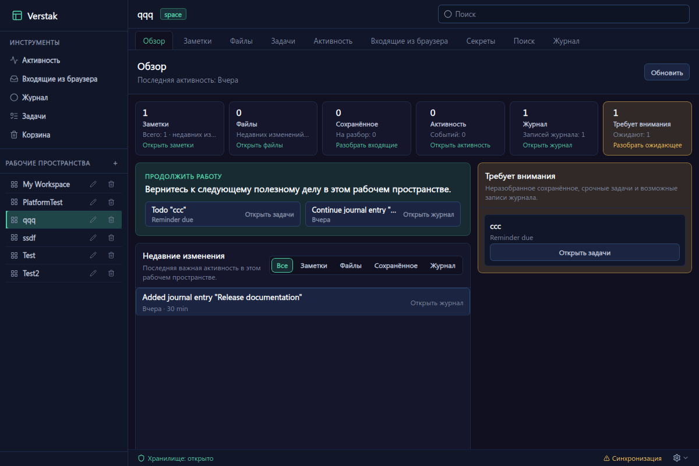
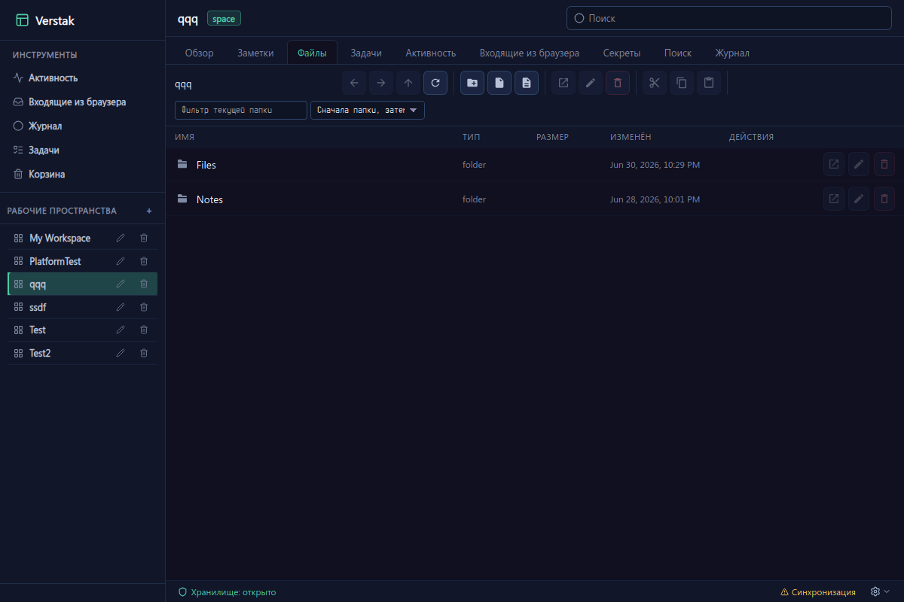
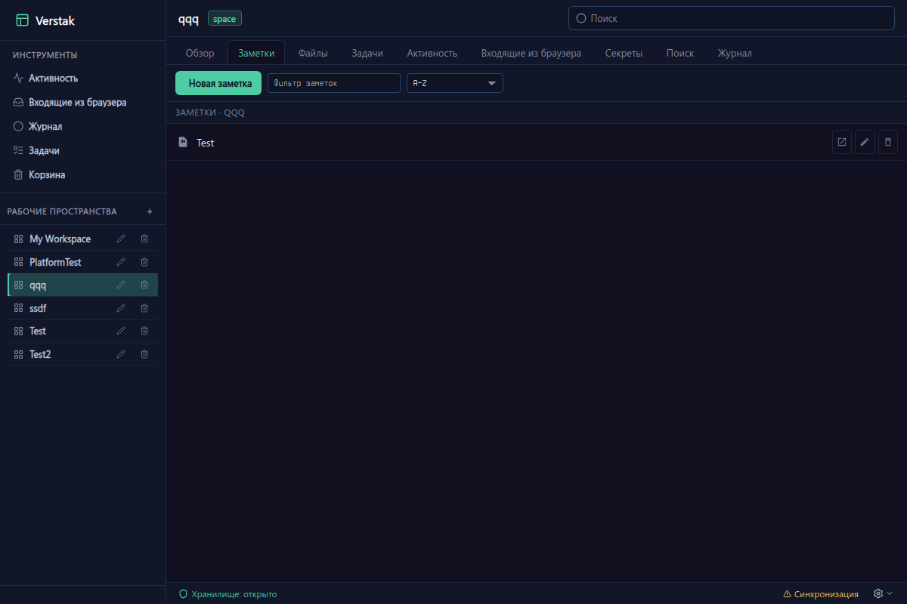
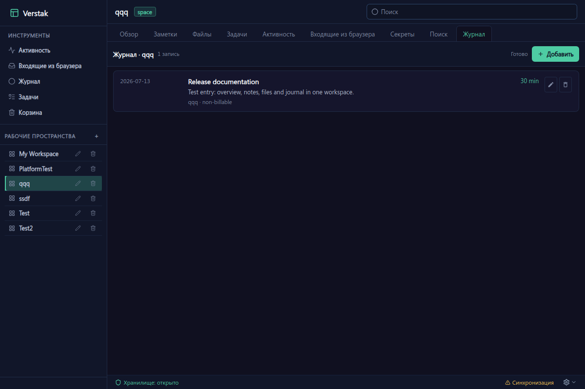

<div align="center">


# Verstak

### Keep the context of your work together — locally.

Files, notes, links, browser captures, activity and work history
in one extensible local-first workspace.

**English** · [Русский](README.ru.md)

[](https://github.com/mirivlad/verstak/releases)


[](LICENSE)

[Download](https://github.com/mirivlad/verstak/releases/latest) ·
[Documentation](https://github.com/mirivlad/verstak-docs) ·
[Report an issue](https://github.com/mirivlad/verstak/issues)

</div>

> [!WARNING]
> Verstak is currently **alpha software**. APIs, storage formats and packaging may change before the first stable release. Use a test vault and keep backups of important data.

## What is Verstak?

Verstak is a local-first workbench that keeps the context around your work in one place.

A **workspace** can represent almost anything:

* a software project;
* a client or customer;
* a server or infrastructure site;
* a device under repair;
* an article or research topic;
* a training course;
* a personal long-term project.

Normally, information about such work is scattered across directories, notes, browser tabs, task managers, password managers, terminal history and memory.

Verstak brings it together in a local **vault** that remains under your control.

No account, cloud service or sync server is required for local use.

## Verstak in use

| Overview: return to a workspace and see its recent work, captures and items that need attention. | Files: manage ordinary folders and documents inside a workspace. |
| --- | --- |
|  |  |

| Notes: keep Markdown notes next to the workspace they describe. | Journal: record a completed session and retain its context. |
| --- | --- |
|  |  |

## Main features

| Feature                  | Description                                                                                  |
| ------------------------ | -------------------------------------------------------------------------------------------- |
| **Workspaces**           | Organize files, notes and activity around durable projects, clients and other areas of work. |
| **Files**                | Browse and manage ordinary files stored inside your vault.                                   |
| **Notes**                | Create Markdown notes, overview pages and links between related information.                 |
| **Overview**             | Quickly return to recent work and see what may need attention.                               |
| **Browser Inbox**        | Send pages, links, selections and files from a browser into Verstak.                         |
| **Activity and Journal** | Reconstruct work sessions and turn selected activity into journal entries.                   |
| **Todo**                 | Keep optional task lists inside individual workspaces and across the whole vault.            |
| **Search**               | Search across notes, files and supported plugin data.                                        |
| **Trash**                | Restore deleted items or remove them permanently from one central location.                  |
| **Secrets**              | Keep credentials and access information connected to the relevant workspace.                 |
| **Templates**            | Create repeatable workspace structures for common types of work.                             |
| **Plugins**              | Add, replace or disable tools without turning Verstak into one rigid monolithic application. |
| **Optional sync**        | Synchronize vaults between devices using a self-hosted Verstak Sync Server.                  |

## Download and install

Download the latest build from the
[GitHub Releases page](https://github.com/mirivlad/verstak/releases/latest).

Release packages already include the matching official plugins.

| System                            | Download                                  | Installation                                  |
| --------------------------------- | ----------------------------------------- | --------------------------------------------- |
| Debian 13 / Ubuntu 24.04 or newer | `verstak_<version>_amd64.deb`             | Install through APT.                          |
| Other x86_64 Linux distributions  | `verstak-linux-x86_64-<version>.AppImage` | Make the file executable and run it.          |
| Windows 10/11 x64                 | `verstak-windows-amd64-<version>.zip`     | Extract the archive and launch `Verstak.cmd`. |

### Debian and Ubuntu

```bash
sudo apt install ./verstak_*_amd64.deb
```

Launch Verstak from the application menu or run:

```bash
verstak
```

### AppImage

```bash
chmod +x verstak-linux-x86_64-*.AppImage
./verstak-linux-x86_64-*.AppImage
```

On a system without FUSE support:

```bash
APPIMAGE_EXTRACT_AND_RUN=1 ./verstak-linux-x86_64-*.AppImage
```

### Windows portable version

1. Download `verstak-windows-amd64-<version>.zip`.
2. Extract it to a local directory.
3. Run `Verstak.cmd`.

Do not run Verstak directly from inside the ZIP archive or from a network share.

Verstak uses the Microsoft WebView2 Runtime. It is already included with Windows 11 and most current Windows 10 installations. If Verstak does not start, install the
[Microsoft WebView2 Runtime x64](https://go.microsoft.com/fwlink/p/?LinkId=2124701).

## Background and tray mode

Closing the main window keeps Verstak running in the system tray. Use **Show Verstak** to bring it back and **Quit** to exit the application completely. This lets scheduled Todo reminders continue while the window is hidden.

### Verify a download

Each release includes a `SHA256SUMS` file.

On Linux:

```bash
sha256sum -c SHA256SUMS --ignore-missing
```

## First start

### 1. Create or open a vault

A **vault** is the root directory where Verstak stores your work.

Choose a writable local directory. For example:

```text
Documents/
└── Verstak/
```

Your files and notes remain ordinary files that can be accessed without Verstak.

### 2. Create your first workspace

Inside the vault, create a workspace for a project, client, server, device or another area of work.

For example:

```text
Home server
Customer Alpha
Verstak development
3D printer
Training course
```

### 3. Add context

Open the workspace and add the information needed to return to it later:

* notes and decisions;
* documents and source files;
* useful links;
* access information;
* journal entries;
* tasks;
* materials captured from the browser.

### 4. Return through Overview

The Overview screen shows recent changes, unfinished captures, activity and other useful entry points back into your work.

## How Verstak stores data

Verstak follows several principles:

* your vault is local and works without an account or internet connection;
* files and notes remain readable outside the application;
* synchronization is optional and is not the source of truth;
* the user should understand where data is stored and what happens to it;
* application tools are provided by plugins rather than being permanently embedded into the core.

The desktop application loads plugins from a `plugins/` directory located beside the executable.

## Browser integration

The optional browser extension can send the following into Browser Inbox:

* the current page;
* selected text;
* a link;
* a downloaded or selected file.

Repository:

[mirivlad/verstak-browser-extension](https://github.com/mirivlad/verstak-browser-extension)

To connect the extension:

1. Open Browser Inbox settings in Verstak.
2. Copy the Receiver URL and Pairing Token.
3. Paste them into the extension settings.
4. Save the settings and send a test page.

Passive domain activity tracking is disabled by default. When enabled, it sends bounded time totals by normalized domain. It does not send page contents, keystrokes or full browsing history.

## Optional synchronization

Local use does not require a server.

For synchronization between devices, deploy the optional self-hosted
[Verstak Sync Server](https://github.com/mirivlad/verstak-sync-server).

Each vault is connected separately. The local vault remains the primary copy of your data.

## Build from source

### Requirements

* Go 1.24 or newer;
* Node.js 20 or newer with npm;
* Python 3;
* Git;
* Wails v2 build dependencies;
* WebKitGTK development packages on Linux.
* Ayatana AppIndicator development files on Linux (`sudo apt install libayatana-appindicator3-dev`).

See the
[Wails installation documentation](https://wails.io/docs/gettingstarted/installation/)
for distribution-specific dependencies.

### Clone the repositories

The desktop, SDK and official plugin repositories must be cloned as sibling directories:

```text
verstak-workspace/
├── verstak/
├── verstak-sdk/
└── verstak-official-plugins/
```

```bash
mkdir verstak-workspace
cd verstak-workspace

git clone https://github.com/mirivlad/verstak.git
git clone https://github.com/mirivlad/verstak-sdk.git
git clone https://github.com/mirivlad/verstak-official-plugins.git
```

### Build

```bash
cd verstak-sdk
./scripts/build.sh

cd ../verstak-official-plugins
./scripts/build.sh

cd ../verstak
./scripts/install-dev-plugins.sh
./scripts/build.sh
```

The resulting application will be located at:

```bash
./build/bin/verstak-desktop
```

Run it with additional diagnostics:

```bash
./build/bin/verstak-desktop --debug
```

## Build release packages locally

These commands create local artifacts in `release/`. They do not publish a GitHub Release.

### Debian package

```bash
./scripts/package-deb.sh v0.1.0-alpha.1
```

### AppImage

```bash
./scripts/package-appimage.sh v0.1.0-alpha.1
```

### Windows portable ZIP

The Windows archive can be cross-compiled on Linux using MinGW:

```bash
sudo apt install gcc-mingw-w64-x86-64 zip
./scripts/package-windows-portable.sh v0.1.0-alpha.1
```

## Project repositories

| Repository                                                                         | Purpose                                                |
| ---------------------------------------------------------------------------------- | ------------------------------------------------------ |
| [verstak](https://github.com/mirivlad/verstak)                                     | Desktop application, core platform and UI shell        |
| [verstak-official-plugins](https://github.com/mirivlad/verstak-official-plugins)   | Official Files, Notes, Journal, Todo and other plugins |
| [verstak-sdk](https://github.com/mirivlad/verstak-sdk)                             | TypeScript SDK, schemas and plugin contracts           |
| [verstak-browser-extension](https://github.com/mirivlad/verstak-browser-extension) | Browser capture and optional activity integration      |
| [verstak-sync-server](https://github.com/mirivlad/verstak-sync-server)             | Optional self-hosted synchronization server            |
| [verstak-docs](https://github.com/mirivlad/verstak-docs)                           | Product and platform architecture documentation        |

Compatible components should be built from the same release line.

## Development status

Verstak is under active development.

The current alpha is intended for testing, feedback and experimentation. Backward compatibility is not guaranteed until the first stable release.

Bug reports and feature discussions are welcome in
[GitHub Issues](https://github.com/mirivlad/verstak/issues).

## License

Copyright © 2026 Verstak contributors.

Verstak is licensed under the
[GNU Affero General Public License v3.0 or later](LICENSE).
