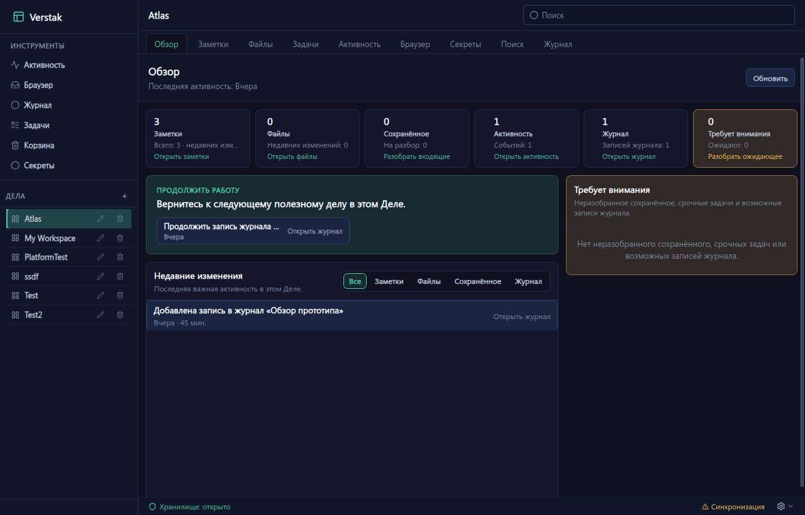
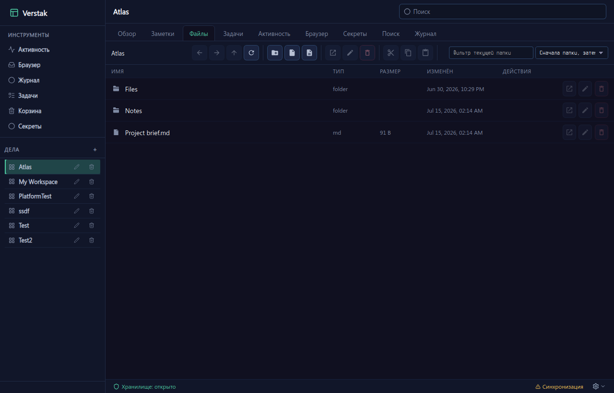
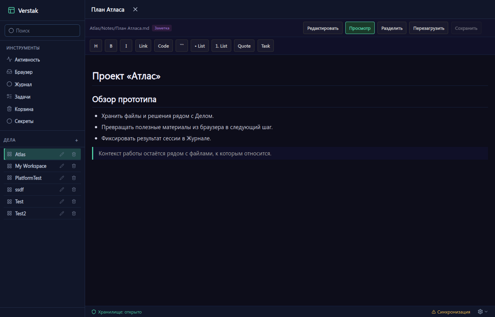
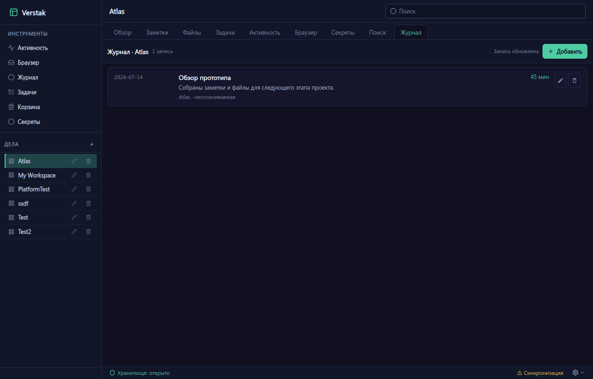

<div align="center">


# Верстак

### Рабочий контекст остаётся рядом — и хранится локально.

Файлы, заметки, ссылки, материалы из браузера, активность и история работы
в одной расширяемой локальной среде.

[English](README.md) · **Русский**

[](https://github.com/mirivlad/verstak/releases)


[](LICENSE)

[Скачать](https://github.com/mirivlad/verstak/releases/latest) ·
[Документация](https://github.com/mirivlad/verstak-docs) ·
[Сообщить о проблеме](https://github.com/mirivlad/verstak/issues)

</div>

> [!WARNING]
> Верстак пока находится на стадии **alpha**. До первого стабильного выпуска могут меняться API, форматы хранения и состав пакетов. Для знакомства используйте тестовый vault и сохраняйте резервные копии важных данных.

## Что такое Верстак

Верстак — это local-first рабочая среда, которая удерживает в одном месте контекст вокруг ваших дел.

**Делом** может быть что угодно:

* программный проект;
* клиент или заказчик;
* сервер или площадка;
* ремонтируемое устройство;
* статья или исследование;
* учебный курс;
* личный долгосрочный проект.

Обычно информация о таком деле расползается по папкам, заметкам, браузерным вкладкам, менеджерам задач, хранилищам паролей, истории терминала и памяти.

Верстак собирает её в один локальный **vault**, который остаётся под вашим контролем.

Для локальной работы не нужны учётная запись, облачный сервис или собственный сервер.

## Верстак в работе

| Обзор: возвращает к делу и показывает недавнюю работу, входящие и то, что требует внимания. | Файлы: обычные папки и документы прямо внутри дела. |
| --- | --- |
|  |  |

| Заметки: Markdown-заметки остаются рядом с делом, которое они описывают. | Журнал: фиксирует завершённую работу и её контекст. |
| --- | --- |
|  |  |

## Основные возможности

| Возможность              | Что она даёт                                                                                   |
| ------------------------ | ---------------------------------------------------------------------------------------------- |
| **Дела**                 | Объединяют файлы, заметки и историю работы вокруг проектов, клиентов и других направлений.     |
| **Файлы**                | Позволяют работать с обычными файлами, расположенными внутри vault.                            |
| **Заметки**              | Markdown-заметки, обзорные страницы и связи между материалами.                                 |
| **Обзор**                | Помогает быстро вернуться к недавней работе и увидеть то, что требует внимания.                |
| **Входящие из браузера** | Принимают страницы, ссылки, выделенный текст и файлы из браузера.                              |
| **Активность и журнал**  | Помогают восстановить рабочие сессии и превратить выбранную активность в записи журнала.       |
| **Задачи**               | Необязательные списки задач внутри отдельных дел и во всём vault.                              |
| **Поиск**                | Ищет по заметкам, файлам и данным поддерживаемых плагинов.                                     |
| **Корзина**              | Позволяет восстановить удалённое или окончательно удалить его из одного общего раздела.        |
| **Секреты**              | Хранит доступы и учётные данные рядом с делом, к которому они относятся.                       |
| **Шаблоны**              | Создают повторяемую структуру для однотипных дел.                                              |
| **Плагины**              | Позволяют добавлять, заменять и отключать инструменты, не превращая Верстак в жёсткий монолит. |
| **Синхронизация**        | Необязательно синхронизирует vault между устройствами через собственный сервер.                |

## Скачивание и установка

Готовые сборки находятся на странице
[GitHub Releases](https://github.com/mirivlad/verstak/releases/latest).

В релизные пакеты уже входят совместимые версии официальных плагинов. Устанавливать их отдельно не требуется.

| Система                          | Какой файл скачать                       | Как установить                               |
| -------------------------------- | ---------------------------------------- | -------------------------------------------- |
| Debian 13 / Ubuntu 24.04 и новее | `verstak_<версия>_amd64.deb`             | Установить через APT.                        |
| Другие дистрибутивы Linux x86_64 | `verstak-linux-x86_64-<версия>.AppImage` | Сделать файл исполняемым и запустить.        |
| Windows 10/11 x64                | `verstak-windows-amd64-<версия>.zip`     | Распаковать архив и запустить `Verstak.cmd`. |

### Debian и Ubuntu

```bash
sudo apt install ./verstak_*_amd64.deb
```

После установки запустите Верстак из меню приложений или командой:

```bash
verstak
```

### AppImage

```bash
chmod +x verstak-linux-x86_64-*.AppImage
./verstak-linux-x86_64-*.AppImage
```

Если в системе нет поддержки FUSE:

```bash
APPIMAGE_EXTRACT_AND_RUN=1 ./verstak-linux-x86_64-*.AppImage
```

### Портативная версия для Windows

1. Скачайте `verstak-windows-amd64-<версия>.zip`.
2. Распакуйте архив в локальную папку.
3. Запустите `Verstak.cmd`.

Не запускайте Верстак прямо из ZIP-архива или с сетевого диска.

Верстак использует Microsoft WebView2 Runtime. Он уже присутствует в Windows 11 и большинстве актуальных установок Windows 10. Если приложение не запускается, установите
[Microsoft WebView2 Runtime x64](https://go.microsoft.com/fwlink/p/?LinkId=2124701).

## Фоновая работа и трей

После готовности значка в трее закрытие главного окна не завершает Верстак. Один левый клик возвращает и фокусирует окно, правый клик открывает нативное меню **«Показать Верстак»** и **«Выйти»**. **«Выйти»** полностью завершает приложение. Если трей не удалось запустить, закрытие окна завершает приложение обычным образом и не оставляет недоступный процесс. Пока окно скрыто, напоминания Todo продолжают работать.

### Проверка скачанного файла

В каждый релиз входит файл `SHA256SUMS`.

Проверка в Linux:

```bash
sha256sum -c SHA256SUMS --ignore-missing
```

## Первый запуск

### 1. Создайте или откройте vault

**Vault** — это корневая папка, в которой Верстак хранит ваши дела.

Выберите доступный для записи локальный каталог. Например:

```text
Документы/
└── Верстак/
```

Файлы и заметки остаются обычными файлами. Их можно открыть и без Верстака.

### 2. Создайте первое дело

Внутри vault создайте дело для проекта, клиента, сервера, устройства или другого направления работы.

Например:

```text
Домашний сервер
Заказчик Альфа
Разработка Верстака
3D-принтер
Учебный курс
```

### 3. Соберите контекст

Добавьте в дело всё, что поможет вернуться к нему через неделю, месяц или год:

* заметки и принятые решения;
* документы и исходные файлы;
* полезные ссылки;
* данные для доступа;
* записи журнала;
* задачи;
* материалы, отправленные из браузера.

### 4. Возвращайтесь через Обзор

Экран «Обзор» показывает недавние изменения, необработанные входящие, активность и другие подходящие точки для продолжения работы.

## Как Верстак хранит данные

Верстак придерживается нескольких принципов:

* vault хранится локально и доступен без учётной записи и интернета;
* файлы и заметки остаются читаемыми вне приложения;
* синхронизация является дополнением, а не источником истины;
* пользователь должен понимать, где находятся его данные и что с ними происходит;
* инструменты реализуются плагинами, а не навсегда встраиваются в ядро.

Настольное приложение загружает плагины из каталога `plugins/`, расположенного рядом с исполняемым файлом.

## Интеграция с браузером

Необязательное расширение позволяет отправлять во «Входящие из браузера»:

* текущую страницу;
* выделенный текст;
* ссылку;
* выбранный или скачанный файл.

Репозиторий расширения:

[mirivlad/verstak-browser-extension](https://github.com/mirivlad/verstak-browser-extension)

Чтобы подключить расширение:

1. Откройте настройки «Входящих из браузера» в Верстаке.
2. Скопируйте адрес приёмника и токен сопряжения.
3. Вставьте их в настройки расширения.
4. Сохраните настройки и отправьте тестовую страницу.

Пассивный учёт активности по доменам по умолчанию отключён. После включения расширение передаёт только ограниченные интервалы времени для нормализованных доменов. Оно не отправляет содержимое страниц, нажатия клавиш или полную историю посещений.

## Необязательная синхронизация

Для локального использования сервер не нужен.

Для синхронизации между устройствами можно развернуть собственный
[Verstak Sync Server](https://github.com/mirivlad/verstak-sync-server).

Каждый vault подключается отдельно. Основной копией данных остаётся локальный vault.

## Сборка из исходного кода

### Требования

* Go 1.24 или новее;
* Node.js 20 или новее и npm;
* Python 3;
* Git;
* ImageMagick (`magick`) для генерации фирменных значков трея и приложения;
* зависимости для сборки Wails v2;
* пакеты разработки WebKitGTK в Linux.

Зависимости для конкретного дистрибутива перечислены в
[документации Wails](https://wails.io/docs/gettingstarted/installation/).

### Клонирование репозиториев

Desktop, SDK и официальные плагины должны находиться в соседних каталогах:

```text
verstak-source/
├── verstak/
├── verstak-sdk/
└── verstak-official-plugins/
```

```bash
mkdir verstak-source
cd verstak-source

git clone https://github.com/mirivlad/verstak.git
git clone https://github.com/mirivlad/verstak-sdk.git
git clone https://github.com/mirivlad/verstak-official-plugins.git
```

### Сборка

```bash
cd verstak-sdk
./scripts/build.sh

cd ../verstak-official-plugins
./scripts/build.sh

cd ../verstak
./scripts/install-dev-plugins.sh
./scripts/build.sh
```

Готовое приложение появится по адресу:

```bash
./build/bin/verstak-desktop
```

Запуск с дополнительной диагностикой:

```bash
./build/bin/verstak-desktop --debug
```

## Локальная сборка релизных пакетов

Следующие команды создают пакеты в каталоге `release/`, но не публикуют GitHub Release.

### Пакет Debian

```bash
./scripts/package-deb.sh v0.1.0-alpha.1
```

### AppImage

```bash
./scripts/package-appimage.sh v0.1.0-alpha.1
```

### Портативный ZIP для Windows

Windows-версию можно собрать в Linux при помощи MinGW:

```bash
sudo apt install gcc-mingw-w64-x86-64 zip
./scripts/package-windows-portable.sh v0.1.0-alpha.1
```

## Репозитории проекта

| Репозиторий                                                                        | Назначение                                                                |
| ---------------------------------------------------------------------------------- | ------------------------------------------------------------------------- |
| [verstak](https://github.com/mirivlad/verstak)                                     | Настольное приложение, ядро платформы и оболочка интерфейса               |
| [verstak-official-plugins](https://github.com/mirivlad/verstak-official-plugins)   | Официальные плагины файлов, заметок, журнала, задач и других инструментов |
| [verstak-sdk](https://github.com/mirivlad/verstak-sdk)                             | TypeScript SDK, схемы и контракты плагинов                                |
| [verstak-browser-extension](https://github.com/mirivlad/verstak-browser-extension) | Отправка материалов из браузера и необязательный учёт активности          |
| [verstak-sync-server](https://github.com/mirivlad/verstak-sync-server)             | Необязательный собственный сервер синхронизации                           |
| [verstak-docs](https://github.com/mirivlad/verstak-docs)                           | Продуктовая и архитектурная документация                                  |

Совместимые компоненты следует собирать из одной релизной линии.

## Состояние разработки

Верстак активно развивается.

Текущая alpha предназначена для тестирования, обратной связи и экспериментов. До первого стабильного выпуска обратная совместимость не гарантируется.

Сообщения об ошибках и предложения принимаются в
[GitHub Issues](https://github.com/mirivlad/verstak/issues).

## Лицензия

Copyright © 2026 Verstak contributors.

Верстак распространяется на условиях
[GNU Affero General Public License v3.0 или новее](LICENSE).
